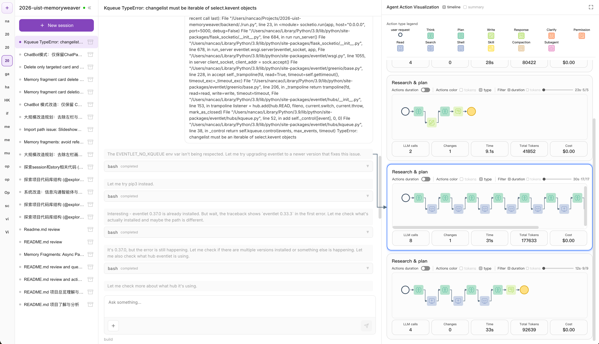

# VibeTrace: See how your agents think
**Visualizing Agent Runtime Behavior for Human Intervention in Vibe Coding**

A web dashboard for **[OpenCode](https://opencode.ai/)** that connects to a local OpenCode HTTP server (REST + Server-Sent Events), enabling developers to work across multiple directories while inspecting live message streams, todos, subtasks, and visualized agent execution flows. The system provides rich cross-linking between todos, transcripts, and individual action-flow blocks, supporting real-time monitoring, navigation, and intervention during agent runtime execution.

---

## UI preview

<p align="center">

</p>

---

## What’s included

- **Action-flow visualization** — Orthogonal layout of mapped tool/agent steps, branching forks, contextual tooltips, and click-to-focus that ties the flow to todos and transcripts. **`Actions duration`** toggles between fixed step spacing and horizontally scaled blocks keyed to measured duration. **`Actions color`** switches the palette between **tokens** and **tool type** lenses. Toolbar **`timeline` / `summary`** changes how planner subtasks are arranged in the rail; fullscreen is available for the flow view.
- **Multi-directory sessions** via `x-opencode-directory`, aligned with how OpenCode labels workspaces from the CLI.
- **Realtime harness UI** — Streamed assistant turns, todos and `todo_write` batch replay, approve/reject for question tooling.
- **Subtask linkage** — Optional connectors from todo rows into a linked card **or into the focused action** when one is selected.
- **Session operations** — Rename, fork, SSE with polling fallback, optional outbound harness guidance prefix on user prompts.

---

## Installation & Running

### 1. Install the OpenCode CLI

VibeTrace requires the OpenCode CLI running in HTTP headless mode.

Follow the [upstream installation guide](https://opencode.ai/download), then verify the installation:

```bash
opencode --version
```


---

### 2. Start the OpenCode HTTP Server

Launch the server with:

```bash
opencode serve
```

By default, the server listens on an address similar to:

```txt
http://127.0.0.1:4096
```

If the port changes, make sure to update it in `.env.local` as well.

You can also specify a fixed port explicitly:

```bash
opencode serve --port 4096
```

---

### 3. Configure Environment Variables

Create a local environment file:

```bash
cp .env.example .env.local
```

Then set the OpenCode server endpoint (either name works; use one line):

```env
VITE_OPENCODE_BASE=http://127.0.0.1:4096
```

or the same value as memory-worker:

```env
OPENCODE_BASE=http://127.0.0.1:4096
```

| Variable | Description |
| --- | --- |
| `VITE_OPENCODE_BASE` **or** `OPENCODE_BASE` | Base URL for all VibeTrace → OpenCode API calls. Vite merges **`VITE_OPENCODE_BASE` first**, then falls back to **`OPENCODE_BASE`**, then `http://127.0.0.1:4096`. Set both only if you intentionally want the UI to override the worker-only variable. |
| `VITE_MEMORY_WORKER_BASE` *(optional)* | Base URL for the Python memory-worker (`npm run worker:py`). Defaults to `http://127.0.0.1:8714`. Full ingest pipeline and **how `trace.v1` is built** → [docs/memory-worker.md](./docs/memory-worker.md). |
| `VITE_OPENCODE_DEFAULT_MODEL` *(optional)* | Overrides the default bootstrap model using the format `provider/model`. If omitted, OpenCode's default model will be used. |

---

### 4. Install Dependencies & Start the UI

Install project dependencies:

```bash
npm install
```

Start the development server:

```bash
npm run dev
```

The frontend development server runs at:

```txt
http://localhost:5173
```

(See `vite.config.ts` for configuration details.)

Make sure the `opencode serve` process remains running while using the UI.

---

## Repository layout

- **`src/App.tsx`** and **`src/components/`** wire sessions, transcripts, todos, connectors, dialogs, fullscreen views.
- **`src/services/opencodeApi.ts`** is the canonical HTTP/SSE client.
- **`src/utils/`** contains folder helpers, todo materialization, SSE parsing, **`MappedAction`** construction, grouping, and forks.
- **`docs/`** stores design/integration notes outside the runtime bundle.
- **`fig/`** holds README imagery.
- **`scripts/`** holds tooling such as `smoke-opencode-session.mjs` for probing a live daemon.

Treat the authoritative API contract as the pair **running `opencode serve`** + **`src/services/opencodeApi.ts`**.

---

## Tech stack

React 19 · TypeScript · Vite · Tailwind CSS 4 · d3 · react-tooltip

---

## License

[MIT](./LICENSE).
