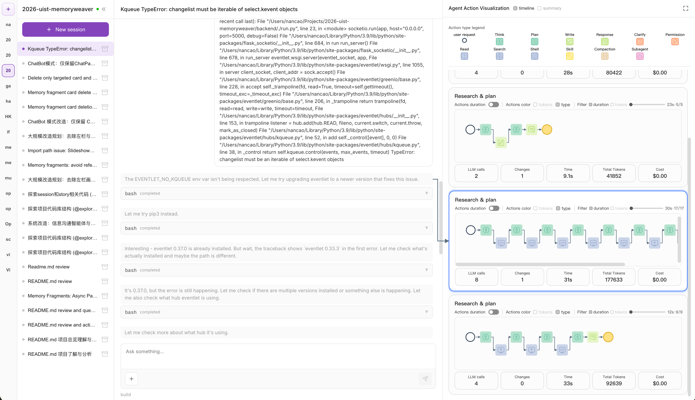

# VibeTrace: See how your agents think

**Visualizing Agent Runtime Behavior for Human Intervention in Vibe Coding**

A web dashboard for **[OpenCode](https://opencode.ai/)** that connects to a local OpenCode HTTP server (REST + Server-Sent Events). VibeTrace gives developers a live, layered view of agent execution and supports **action-level process intervention** — fork, inspect, and steer runs without losing trajectory context.

---

## UI preview

<p align="center">

</p>

---

## Two core capabilities

### 1. Layered real-time execution visualization

VibeTrace turns raw OpenCode message streams into a structured, reviewable execution surface:

- **Task-aware session view** — Detects when the user switches tasks inside a session and surfaces each completed task as its own tab, so trajectories from different goals are not mixed together.
- **Subtask panels from todos** — Within a task, planner todos are materialized into subtask panels. Each panel shows the action-flow trace for that slice of work, making it easy to locate and audit specific steps.
- **Rich action-flow rendering** — Orthogonal layout of mapped tool/agent steps, branching forks, contextual tooltips, and click-to-focus linking between the flow, todos, and transcripts. **`Actions duration`** toggles between fixed step spacing and horizontally scaled blocks keyed to measured duration. **`Actions color`** switches the palette between **tokens** and **tool type** lenses. Toolbar **`timeline` / `summary`** changes how subtasks are arranged in the rail; fullscreen is available for the flow view.
- **Per-panel analysis** — Each subtask panel can show a trace summary and automated error diagnosis to help you understand what happened and where things went wrong.
- **Cross-linking** — Optional connectors from todo rows into a linked card **or into the focused action** when one is selected.

### 2. Action-level process intervention

Beyond observation, VibeTrace supports interactive steering grounded in the live trajectory:

- **Fork from any action** — Branch the session at a specific tool/agent step, capture a pre-fork panel snapshot, and continue in a new OpenCode session while preserving comparison context.
- **Trajectory-based branching** — Fork connectors and ghost trails show how a branched run diverges from the parent path, so you can experiment without losing sight of the original execution.


---

## Installation & Running

**Recommended:** use the VibeTrace plugin — no need to manually run `opencode serve`, `npm run dev`, or `npm run worker:py`.

You also need **Python 3** on your machine for the memory-worker (`python` on Windows, `python3` on macOS/Linux).

### 1. Install OpenCode

Follow the [upstream installation guide](https://opencode.ai/download), then verify:

```bash
opencode --version
```


### 2. Clone this repository

```bash
git clone -b V1.5 https://github.com/idvxlab/VibeTrace.git
cd VibeTrace
```

`git clone` creates a folder named **`VibeTrace`** (from the repo name). Use that path in the plugin config below.

### 3. Copy environment file

```bash
cp .env.example .env.local
```

Most OpenCode connection settings are **written automatically by the plugin** (proxy target, port, desktop auth). You usually do not need to edit URLs by hand. Optional overrides: [`.env.example`](./.env.example).

### 4. Install UI dependencies (one-time, required)

```bash
npm install
```

This step **cannot be skipped** for the first time. The plugin starts `npm run dev` and the Python worker for you, but it does **not** run `npm install` — if `node_modules/` is missing, OpenCode logs an error and VibeTrace will not start.

### 5. Register the plugin (one-time)

Add the plugin file’s **absolute path** to your global OpenCode config:

| OS | Global config path |
| --- | --- |
| **Windows** | `%APPDATA%\opencode\opencode.json` |
| **macOS / Linux** | `~/.config/opencode/opencode.json` |

**Windows example** (replace with your clone path):

```json
{
  "$schema": "https://opencode.ai/config.json",
  "plugin": [
    "D:/projects/VibeTrace/plugins/agent-cockpit.ts"
  ]
}
```

**macOS / Linux example** (replace with your clone path):

```json
{
  "$schema": "https://opencode.ai/config.json",
  "plugin": [
    "/Users/you/projects/VibeTrace/plugins/agent-cockpit.ts"
  ]
}
```

Point at **`plugins/agent-cockpit.ts`**, not the repo root. This works from any OpenCode workspace.

**Fully quit and restart OpenCode** after changing config.

### 6. Launch

1. Start the **OpenCode desktop app** 
2. The plugin automatically:
   - updates `.env.local` with the current OpenCode API address and auth
   - starts the memory-worker on **`http://127.0.0.1:8714`**
   - starts the Vite UI on **`http://127.0.0.1:5173`**
   - opens your browser (unless `VIBETRACE_NO_BROWSER=1`)

You should see log lines similar to:

```txt
[VibeTrace] OpenCode API → http://127.0.0.1:xxxx
[VibeTrace] memory-worker ready
[VibeTrace] ready → http://127.0.0.1:5173
[VibeTrace] opening → http://127.0.0.1:5173
```

Open http://127.0.0.1:5173 manually if the browser does not open.

### Daily use (plugin mode)

1. Open **OpenCode** — that’s it.
2. Use VibeTrace in the browser; trace ingest and panel analysis run in the background.


Optional environment variables (plugin mode):

| Variable | When to set |
| --- | --- |
| `SKILL_WRITE_ROOT` | Control where analyzed skills are written (background pipeline) |
| `VITE_OPENCODE_DEFAULT_MODEL` | Default model when sending from VibeTrace (`provider/model`) |
| `VITE_TRACE_SESSION_TURN_LIMIT` | More history turns per ingest (default `5`) |
| `VIBETRACE_NO_BROWSER=1` | Do not auto-open the browser |
| `PYTHON` | Non-default Python executable name |

---

## Tech stack

React 19 · TypeScript · Vite · Tailwind CSS 4 · d3 · react-tooltip

---

## License

[MIT](./LICENSE)
